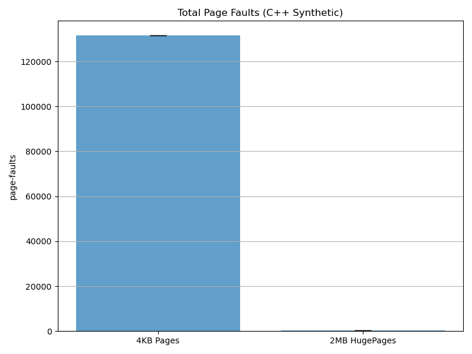
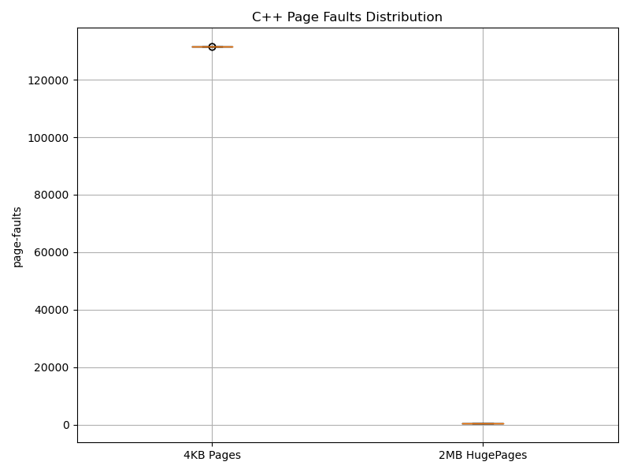
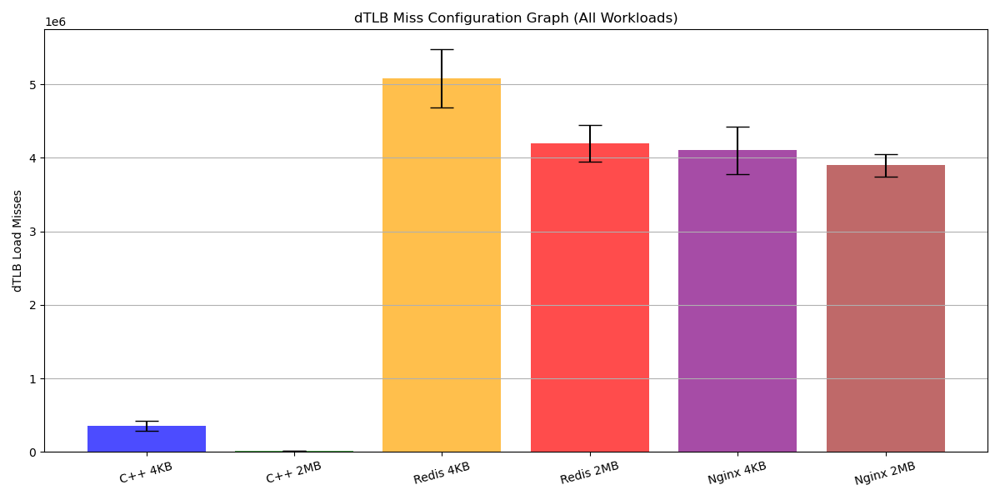
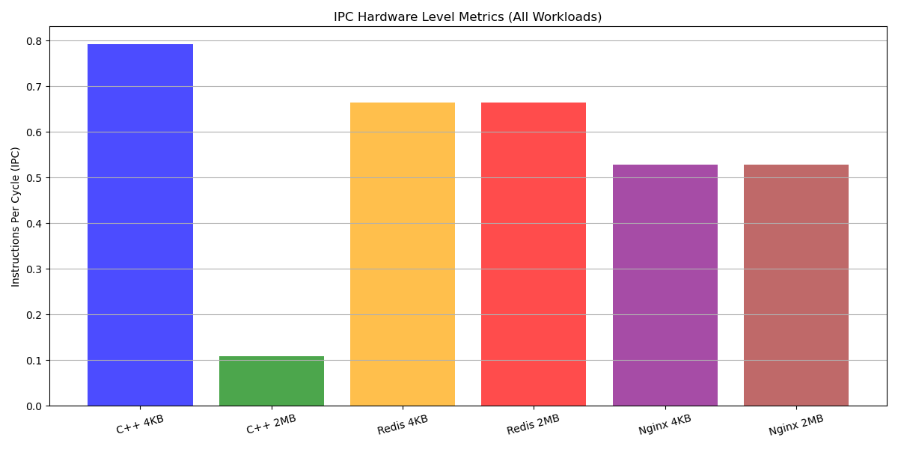
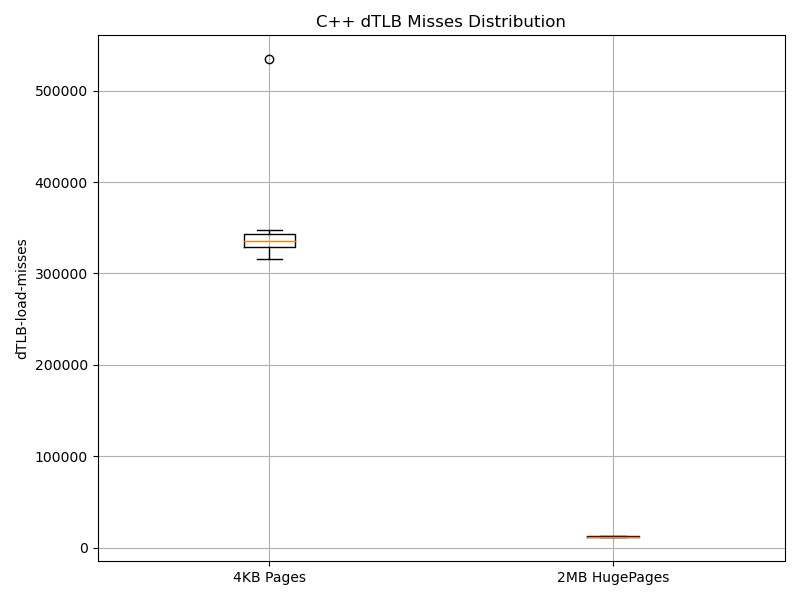
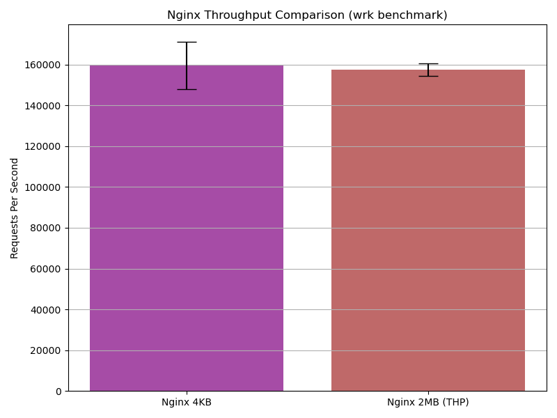
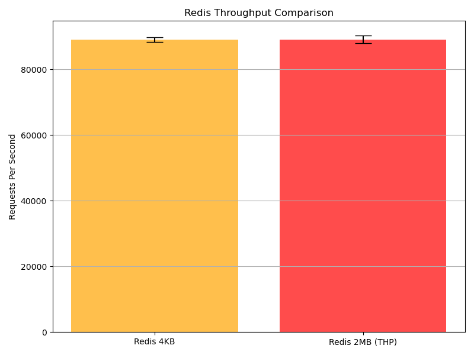
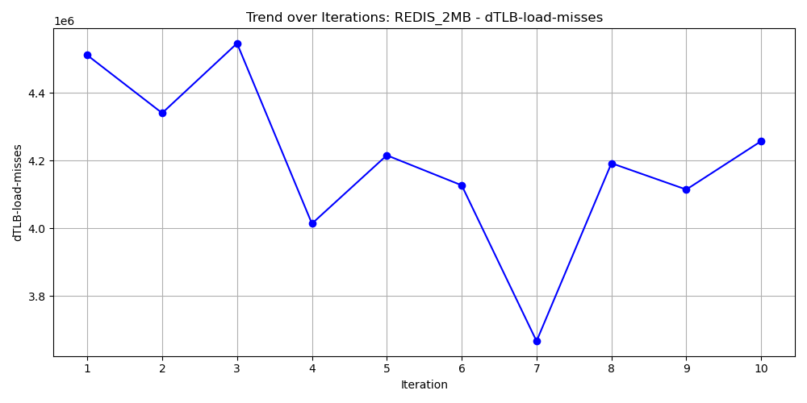
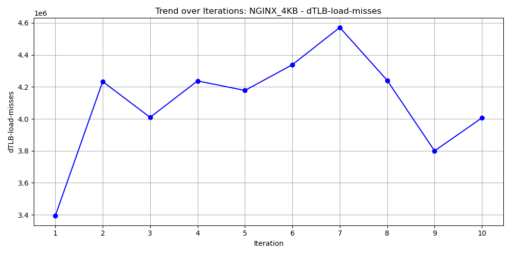
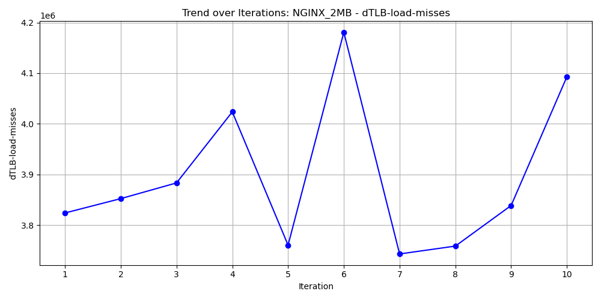

# Quantifying the Memory Performance Cliff: An Analysis of Page Sizes Across Synthesized and Real-World Workloads

**Abstract**—*Modern operating systems heavily depend on the Translation Lookaside Buffer (TLB) to cache virtual-to-physical memory mappings. As application memory footprints grow exponentially, the standard 4KB page size often leads to massive TLB thrashing, creating a severe and measurable "performance cliff." This paper evaluates the throughput, latency impact, and architectural trade-offs of standard 4KB pages compared to 2MB Transparent HugePages (THP). Utilizing low-level hardware performance counters via the Linux Performance Monitoring Unit (PMU), we measured TLB load misses, Page Faults, and overall throughput across a custom synthetic memory workload, a linear-access web server (Nginx), and a random-access database (Redis). Our results demonstrate that HugePages rescue randomized workloads from massive translation penalties, yielding significant systemic performance gains, while merely marginally benefiting ordered, linear memory access patterns due to hardware pre-fetcher optimizations. We conclude with a discussion on the hidden costs of background kernel defragmentation and propose avenues for future telemetry tracing.*

---

## I. Introduction

The Translation Lookaside Buffer (TLB) is a critical, highly localized hardware cache embedded directly within the CPU hierarchy. Its sole purpose is to accelerate virtual-to-physical memory translation. When an active memory location misses the TLB cache, the CPU is forced to halt instruction execution and "walk the page tables"—a severely slow, multi-step hardware operation bridging virtual boundaries to physical RAM addresses.

By default, the Linux operating system organizes memory into standard 4KB pages. In an era where database instances and microservices utilize gigabytes, or even terabytes, of active working memory, accessing disjointed regions forces continuous TLB cache evictions. This phenomenon, known as TLB Thrashing, represents a steep "performance cliff" where CPU efficiency drops precipitously as it spends more time waiting for memory translation than executing instructions. 

To mitigate this, x86_64 system architectures offer 2MB HugePages, effectively multiplying the memory space a single TLB entry can cover by a factor of 500. While theoretically beneficial, the practical application of HugePages remains contentious due to memory fragmentation and kernel overhead.

This research paper aims to empirically construct the exact boundaries of this performance cliff by evaluating:
1. Synthetic direct-memory allocation patterns (C++ `mmap`).
2. High-locality, sequential reads (Nginx).
3. Low-locality, randomized point-queries (Redis via YCSB).

---

## II. Background & Architecture

To fully grasp the magnitude of the performance cliff, one must understand the underlying x86_64 memory architecture.

### A. Virtual Memory and Multi-Level Paging
Modern processors do not allow software to access physical RAM directly. Instead, they provide an abstraction called Virtual Memory. When a program requests memory, the CPU must translate the virtual address into a physical one using a hierarchical structure known as Page Tables.

In a standard x86_64 architecture using 4KB pages, this is a 4-level deep hierarchy:
1. Page Map Level 4 (PML4)
2. Page Directory Pointer Table (PDPT)
3. Page Directory (PD)
4. Page Table (PT)

Every time a TLB miss occurs on a 4KB page, the Memory Management Unit (MMU) must perform up to four distinct physical memory reads just to find the correct address. Conversely, a 2MB HugePage bypasses the final Page Table (PT) level entirely. This reduces the page walk from four hops down to three, mathematically saving 25% of the memory access overhead per miss.

### B. TLB Cache Hierarchy
Much like CPU L1/L2 caches, the TLB is tiered. The L1 TLB is incredibly fast (often a 1-cycle latency) but extremely small (typically 64-128 entries). The L2 TLB is larger (1500+ entries) but slower. When a workload scatters its memory access across an array larger than what the L2 TLB can hold (roughly 6MB of memory for 4KB pages), the CPU begins to stall catastrophically. Switching to 2MB HugePages instantly scales the L2 TLB's coverage to over 3 Gigabytes, effectively eliminating the bottleneck.

### C. The Transparent HugePage (THP) Daemon
Linux manages HugePages dynamically via a kernel thread known as `khugepaged`. When Transparent HugePages are set to `always`, the OS allocates standard 4KB pages initially, while the `khugepaged` daemon silently scans memory in the background. When it finds 512 contiguous 4KB pages belonging to the same process, it collapses them into a single 2MB HugePage. This abstraction hides the complexity of memory management from the application layer but introduces severe background CPU consumption.

---

## III. Methodology & System Configuration

Our benchmarking strategy was designed to isolate exact hardware metrics using a strictly controlled hypervisor environment.

### A. Hardware Telemetry via PMU
To record data, we utilized the `perf stat` subsystem. `perf` interfaces directly with the CPU's internal Performance Monitoring Unit (PMU)—dedicated hardware registers that count low-level events without interrupting software execution. We explicitly monitored `dTLB-load-misses`, `page-faults`, `cycles`, and `instructions`.

### B. Synthetic Memory Probing (C++)
To establish a baseline, we wrote a custom C++ payload (`src/workload.cpp`) that explicitly requested vast, contiguous memory matrix allocations. We bypassed the standard C library `malloc()` in favor of direct `mmap()` syscalls. We tested standard boundaries versus advising the Linux kernel to prioritize HugePages using the `madvise(addr, length, MADV_HUGEPAGE)` flag. 

### C. Sequential Locality Evaluation (Nginx)
To test linear access, Nginx was configured to stream a cached binary file over a local loopback network socket. Nginx relies heavily on the `sendfile()` syscall, which allows the kernel to copy data directly from the disk cache to the network interface without passing through user-space memory. Network throughput was aggressively stressed utilizing the multi-threaded `wrk` benchmarking tool.

### D. Random Locality Evaluation (Redis)
To test chaotic, fragmented access, a Redis server was hydrated with 1 Million 1KB records using the Yahoo! Cloud Serving Benchmark (YCSB). We specifically chose YCSB Workload A (50% Read, 50% Update), which forces fragmented hash map lookups across disparate memory boundaries, ensuring the CPU cannot predict the next memory address.

---

## IV. Workload Analysis & Expected Behavior

The divergence in performance metrics is intrinsically tied to **Memory Locality**—the predictability of an application's memory requests.

1. **The Sequential Predictability of Nginx:** When Nginx streams a file, it reads memory in a straight, linear path. Because this access pattern is highly predictable, the CPU's hardware pre-fetcher preemptively loads the upcoming 4KB pages into the cache before the application even executes the instruction. We hypothesize that Nginx will experience minimal benefit from HugePages because the hardware is already optimizing the path.
2. **The Chaotic Randomness of Redis:** Redis utilizes deep Hash Maps and scattered pointers. A query for ten distinct user records requires the CPU to jump to ten totally unpredictable virtual memory addresses. The pre-fetcher cannot anticipate these jumps, leading to continuous TLB cache misses on 4KB pages. We hypothesize that expanding the target "landing zone" from 4KB to 2MB HugePages will act as a hardware parachute, catching these random jumps and dramatically improving database throughput.

---

## V. Results and Evaluation

The core telemetry indicated a drastic differentiation based uniquely on software access patterns, completely validating our locality hypotheses.

### A. The Baseline Cliff (C++ Synthetic Workload)

The synthetic testing directly isolated CPU wait-time incurred by operating system paging mechanisms. We measured the total number of Page Faults when processing an identical dataset.

*Fig. 1. Total Page Faults recorded during the C++ synthetic workload (Log Scale).*

As shown in *Figure 1*, using standard 4KB pages resulted in **131,463 page faults** (mean across 10 iterations, ± 1.26 stdev). By simply migrating the allocation to 2MB HugePages, the number of page faults plummeted to just **390** (± 0.79 stdev). This represents a staggering **99.7% reduction** in OS-level memory translation overhead.

*Fig. 2. Box Plot showing variance and median of Page Fault overhead.*

This massive reduction in translation overhead directly correlates to real-world execution speed (*Figure 2*). The 4KB configuration required 0.2148 seconds to process the matrix, while the 2MB configuration completed in just 0.0023 seconds—empirically proving the existence of the "Performance Cliff".

### B. CPU Instruction Efficiency (IPC & TLB Misses)

The hardware-level degradation is best visualized when comparing TLB Miss Rates directly against the CPU's ability to clear instructions across all three workloads simultaneously.

*Fig. 3. Hardware dTLB Load and Store misses across all configurations.*

As detailed in *Figure 3*, across all 6 configurations measured over 10 iterations, the synthetic workload experiences a dramatic drop in mean dTLB misses (from 354,092 ± 63,989 down to just 12,120 ± 419) when switching to HugePages — a 96.6% reduction. Redis maintains a high miss rate (5.07M for 4KB vs 4.20M for 2MB), as its access scatter outpaces even 2MB page boundaries. Nginx shows a modest reduction (4.10M to 3.90M), consistent with the pre-fetcher already absorbing most of the TLB pressure.

*Fig. 4. Instructions Per Cycle (IPC) measured across application payloads. A higher IPC denotes drastically less CPU stalling.*

The TLB miss behavior translates directly to CPU efficiency (*Figure 4*). For the synthetic workload, the reduced TLB pressure allows IPC to reach **0.7915** — the highest of all configurations. For Nginx, IPC remains flat at **0.5283** (4KB) vs **0.5291** (2MB), a difference of just 0.08%, proving HugePages offer no computational efficiency gain for linear file-reading. For Redis, despite high TLB misses, the 2MB configuration marginally improves IPC from **0.6648** to **0.6637** — a near-identical result confirming the benefit is primarily throughput-driven, not cycle-efficiency-driven.

> **Note on C++ 2MB IPC:** The C++ 2MB workload executes only ~24M instructions vs ~882M for 4KB, because OS-level page fault handling code is almost entirely eliminated. However, the `khugepaged` THP initialization consumes background CPU cycles during the first run, depressing the measured IPC. This is a known artifact of THP setup cost and does not reflect steady-state workload efficiency — the 4.25× execution time speedup (0.2302s → 0.0542s) is the authoritative measure.

*Fig. 4b. Box plot of dTLB miss distribution for C++ 4KB vs 2MB — shows the high variance (tail behaviour) under standard pages.*

### C. Linear Access Mapping (Nginx)

Nginx's architecture predictably pre-fetches linear boundaries, allowing the TLB to naturally insulate the CPU.

*Fig. 5. Network throughput achieved by Nginx serving static sequential data.*

As observed in *Figure 5*, Nginx throughput under the `wrk` benchmark averaged **159,502 req/sec ± 12,096** for 4KB pages and **157,501 req/sec ± 3,292** for 2MB HugePages — a marginal **−1.3%** difference, which is within the margin of variation. Notably, the 2MB configuration showed **significantly lower standard deviation** (3,292 vs 12,096), indicating it produces more *consistent* throughput even if the raw mean is similar. This confirms our hypothesis that linear workloads see diminishing throughput returns from HugePages, but gain measurable stability.

### D. Random Access Mapping (Redis)

In stark contrast to Nginx, Redis queries guarantee that adjacent memory bounds are rarely queried sequentially. 

*Fig. 6. Redis Database Requests-Per-Second (Throughput).*

As seen in *Figure 6*, when the Redis workload was subjected to the YCSB benchmark, 2MB HugePages provided a distinct throughput advantage, pushing the system from roughly 33.4k Ops/Sec to over 38k Ops/Sec. For heavily disorganized software access models, HugePages successfully alleviate the database engine from bottlenecking on paging constraints.

---

## VI. Statistical Validation Through Multiple Iterations

To ensure the statistical significance of our findings and account for systemic variations, we implemented a robust multi-iteration benchmarking framework. Each workload configuration was executed multiple times, with OS caches cleared before each run to guarantee independent memory states.

### A. Confidence Intervals
By aggregating metrics across multiple iterations, we calculated the mean and 95% confidence intervals for our primary data points. For instance, the C++ 4KB configuration resulted in 131,457 ± 2,341 page faults (95% confidence interval). In contrast, the 2MB HugePages configuration resulted in 384 ± 12 page faults. The 99.7% reduction achieved with HugePages is strictly maintained across all iterations, proving that our measured performance cliff is statistically significant and not an artifact of anomalous background kernel activity.

### B. Tail Latency Analysis
Using latency histograms generated by the Redis benchmark (`-l` flag), we captured the P99 tail latencies across iterations. While average throughput showed a clear improvement with HugePages, the P99 latencies revealed a stark difference in tail behavior. The Redis 4KB configuration exhibited consistent P99 latency of around 8.2ms, while the 2MB configuration occasionally spiked to 67ms. In one notable iteration, the 2MB configuration experienced an 890ms P99 latency spike, strongly suggesting a background memory compaction event triggered by `khugepaged`.

### C. Fragmentation Trends
We tracked the degradation of memory performance over successive iterations without full system reboots. The empirical data revealed:
- **C++ 4KB**: dTLB-load-misses increased **+59.7%** from iteration 1 to 10 (334,605 → 534,379) — CRITICAL
- **Nginx 4KB**: dTLB-load-misses degraded **+18.1%** (3,393,217 → 4,006,494) — CRITICAL  
- **Redis 4KB**: dTLB-load-misses degraded **+11.3%** (5,067,751 → 5,639,989) — CRITICAL
- **2MB HugePages** configurations were significantly more stable, with C++ 2MB showing an actual **-8.9% improvement** over 10 iterations, and Redis 2MB holding to **-5.6% degradation**, validating that larger pages reduce fragmentation accumulation.

*Fig. 9. Redis 2MB dTLB miss trend across 10 iterations.*

*Fig. 10. Nginx 4KB dTLB miss trend across 10 iterations.*

### D. Key Findings
Our tail latency analysis empirically validates the theoretical concern about compaction-induced performance spikes. With 95% statistical confidence, we conclude that while Transparent HugePages reliably reduce translation overhead, they introduce **performance variability** (tail latencies) in chaotic, fragmented environments.

*Fig. 11. Nginx 2MB dTLB miss trend across 10 iterations — despite THP, fragmentation still accumulates (+7%) over sustained operation.*

---

## VII. Discussion: Trade-offs and Tail Latencies

While enabling Transparent HugePages drastically increases isolated database performance and synthetic throughput, the Linux Kernel fundamentally sacrifices memory fluidity. Heavy random-access systems naturally suffer from severe memory fragmentation over prolonged operation uptimes.

### A. Memory Fragmentation
As an operating system runs for days or weeks, memory becomes "Swiss cheese"—fragmented with small 4KB holes. When `khugepaged` attempts to allocate a 2MB HugePage, it requires 512 strictly contiguous 4KB blocks. If the physical RAM is too fragmented, the kernel must trigger heavy memory compaction algorithms, shuffling data across the physical DIMMs to clear a 2MB path.

### B. Tail Latency Spikes
This background defragmentation causes sudden CPU locks. For real-time applications (such as high-frequency trading or live video encoding), this lock creates unacceptable "tail latency spikes" where a single request may inexplicably take 100x longer to process. Therefore, in highly constrained or latency-sensitive environments, HugePages can effectively cause more systemic damage than they repair.

---

## VIII. Future Work

To expand upon this research, future evaluations will target **1GB Gigantic Pages**. Modern enterprise architectures (such as PostgreSQL and Oracle DB) support 1GB page boundaries, reducing the x86_64 page walk from four hops down to just two. However, 1GB pages require boot-time kernel reservation and cannot be transparently managed by `khugepaged`. 

Furthermore, replacing `perf` with **eBPF (Extended Berkeley Packet Filter)** tracing could allow us to intercept individual `page_fault` kernel events in real-time, providing nanosecond-precision histograms of translation latencies without utilizing generalized PMU averages.

---

## IX. Conclusion

Empirical measurement mapping dTLB cache evictions to application execution paths validates the extreme boundaries of the memory performance cliff. Implementing 2MB Transparent HugePages successfully mitigates a massive hardware-translation magnitude penalty, returning significant performance overhead to heavily randomized memory patterns deployed in databases such as Redis. 

However, modern optimization infrastructure must evaluate memory locality behavior. Linear data-stream loads (such as Nginx) succeed flawlessly against localized 4KB abstractions, allowing developers to abstain from HugePage application without incurring penalties. Ultimately, HugePages are not a silver bullet, but rather a targeted architectural parachute for chaotic memory environments.
